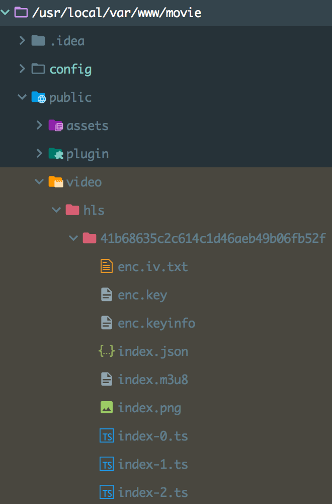

# 看电影
> 🎥 好酷！超简洁！要快速搭建的`弹幕`电影网站项目。
http://video.shengxuecheng.cn/

## 环境 
> 下载稳定的版本 `Stable Version` 不用一样。

[](https://www.php.net/downloads.php)
[](http://nginx.org/en/download.html)
[](https://dev.mysql.com/downloads/mysql/)
[](http://www.ffmpeg.org/download.html) 
[](https://redis.io/download) 

## 安装
- 建立`nginx`服务目录，以下是示例：
> 入口文件为：`/movie/public/index.php`

```nginx
server {
    charset utf-8;
    listen 80;
    server_name [域名];

    # 示例服务地址
    root   /home/wwwroot/default/movie/public;
    index  index.php index.html;

    include enable-php.conf;

    access_log /home/wwwlogs/access.log;
    error_log /home/wwwlogs/error.log;
}
```

- 克隆`release`分支到服务目录：
```shell
git clone -b release git@github.com:eson-sheng/movie.git
```

- 执行项目中的`SQL`文件：
```shell
/movie/sql/movie.sql
```

- 编写`MySQL`配置文件：
> `/movie/config/local_database.php`

```php
<?php

return [
    'database' => 'movie',
    'password' => '***您的数据库密码***',
];
```

- 另外，视频的资源目录：
1. 格式为`mp4`的视频可以直接放在`/movie/public/video`目录下，浏览首页时会自动解析列表生成缩略图。
2. 关于`hls`的视频需要使用工具切成`ts`格式生成`m3u8`的播放列表索引的`hash`目录，放在`/movie/public/video/hls`项目目录地址里。如图：

`enc.iv.txt` - `iv`的`hash`偏移量
`enc.key` - 视频加密用的秘钥
`index.json` - 视频信息说明示例：
```json
{
  "name": "我的影片",
  "hash": "md5(我的影片)"
}
```
`index.m3u8` - 切片视频`ts`的播放列表
`index.png` - 视频缩略图
`index-%d.ts` - 加密的切片`ts`视频

### 添加`hls`视频的工具：`addMovie`
使用命令行执行： 
`php addMovie --path "{path}"`

## 目录结构
初始的目录结构如下：
```
./movie                    项目部署根目录
├── README.md              自述文件
├── addMovie               命令行添加视频工具
├── config                 应用配置目录
│   ├── database.php       数据库配置
│   ├── local_database.php 本地化数据库配置
│   ├── local_params.php   本地化参数配置
│   └── params.php         参数配置
├── public                 WEB目录（对外访问目录）
│   ├── assets             静态资源目录
│   │   ├── css            css文件目录
│   │   │   ├── error.css  错误页面css样式表
│   │   │   └── index.css  默认页css样式表
│   │   ├── img            图片目录
│   │   │   ├── hls.png    hls图片示例
│   │   │   └── play.png   播放图片动画
│   │   └── js             js文件目录
│   │       └── index.js   默认页js特效文件
│   ├── favicon.ico        标题小图标
│   ├── index.php          入口文件
│   ├── plugin             插件目录
│   │   ├── dplayer        dplayer插件
│   │   │   └── ...
│   │   └── hls.js         hlsjs插件
│   │           └── ...
│   └── video             视频资源目录 - MP4
│       ├── hls           视频资源目录 - m3u8
│       └── thum          视频缩略图目录
├── sql                   SQL文件目录
│   └── movie.sql         MySQL文件初始化建立数据库
└── src                   应用目录
    ├── ResponseCode.php  错误码类文件
    ├── autoload.php      自动加载文件
    ├── common.php        公共函数文件
    ├── controller        控制器目录
    │   └── Index.php     默认控制器
    ├── model             模型目录
    │   ├── Danmaku.php   弹幕模型文件
    │   ├── Index.php     默认模型文件
    │   ├── Token.php     令牌模型文件
    │   └── Video.php     视频模型文件
    ├── validate          验证器目录
    │   ├── Danmaku.php   弹幕验证器文件
    │   └── Index.php     默认验证器文件
    └── view              视图层目录
        ├── error.html    错误视图页面文件
        ├── index.html    默认视图页面文件
        └── show.html     视频显示视图页面文件

20 个文件夹目录, 38 个文件, 6.6M 的总大小

```

## 配置讲述
配置在`./movie/config` 目录中有两个文件：`database.php`是数据配置，`params.php`是弹幕接口参数配置。只要在新建文件前加上`local_`前缀就可以覆盖及合并。

# 关于码主
**我的博客：http://shengxuecheng.cn/**
